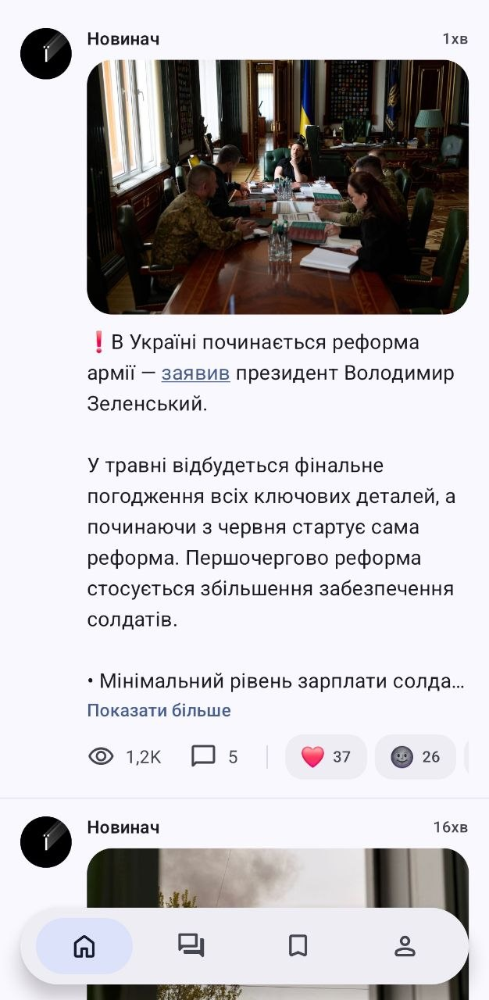

# Hortay

Twitter-подібна читалка Telegram-каналів. Підписки відкриваються однією хронологічною стрічкою, а не списком чатів.

Без Firebase, Crashlytics, аналітики, сторонніх push-сервісів. Дозвіл INTERNET використовується тільки для Telegram і — в гостьовому режимі — для анонімних `t.me/s/` прев'ю.

<p align="center">
  <a href="https://play.google.com/store/apps/details?id=dev.lyo.hortay">
    
  </a>
</p>

<p align="center">
  
</p>

## Що всередині

- **Два режими** — повний MTProto через TDLib або гостьовий режим читання публічних `t.me/s/<канал>` без облікового запису
- **UX читача** — режим OldestUnreadFirst із межею прочитаного, dwell-based read-tracking, snap-скрол, вкладки папок, FAB до низу з лічильником непрочитаного
- **Усі формати постів** — опитування (голосування, quiz reveal, multi-answer), реакції, кастомні emoji, анімовані стікери (TGS/WebM/WEBP), альбоми, інлайн-відео, кругові відеоповідомлення
- **Коментарі** як overlay з predictive back, ланцюжки відповідей, шит профілю користувача
- **Material 3 Expressive** — dynamic color, motion scheme, врахування reduced motion
- **Англійська і українська** з повними plural-формами

## Збірка

Потрібно: JDK 17, Docker (для TDLib), Android SDK

1. Отримайте `api_id` / `api_hash` на <https://my.telegram.org> → API development tools
2. Скопіюйте `local.properties.example` у `local.properties` і впишіть ключі
3. Зберіть TDLib через Docker (~30 хв перший запуск, ~10 хв далі):

   ```bash
   ./scripts/update-tdlib.sh                  # upstream master (останній збір зафіксовано в scripts/tdlib-version.txt)
   ./scripts/update-tdlib.sh 8fc2344f         # конкретний commit SHA
   ```

4. Встановіть debug-білд:

   ```bash
   ./gradlew :app:installDebug
   ```

Gradle wrapper закомічено — окремий `gradle wrapper` не потрібен

## Стек

AGP 9.2.0 · Gradle 9.4.1 · Kotlin 2.3.10 (K2) · Compose BOM 2026.04.01 · Material 3 1.5.0-alpha19 · minSdk 26 / targetSdk 36 · TDLib запінено в `scripts/tdlib-version.txt` · Coroutines 1.10.1 · Coil 3.3.0 · SQLDelight 2.3 (тільки гостьовий режим) · DataStore 1.2.0

## Архітектура

Розклад модулів, load-bearing рішення і правила роботи з TDLib — у [ARCHITECTURE.md](ARCHITECTURE.md).

Коротко: single-Activity, тільки Compose, три модулі — `:app`, `:libtdlib` (vendored TDLib JNI), `:baselineprofile`. Manual DI через `AppGraph`. Без Hilt, без Retrofit, без Firebase.

## Контрибуції

Issues і PR — welcome. Перед нетривіальними змінами читайте [ARCHITECTURE.md](ARCHITECTURE.md): багато рішень є load-bearing і задокументовані поряд із кодом. Conventional Commits зі скоупом-пакетом: `feat(timeline):`, `fix(media):`, `build(beta):` тощо.

## Безпека

Як повідомити про вразливість — [SECURITY.md](SECURITY.md).

## Ліцензія

[GPL-3.0-or-later](LICENSE)

---

Зроблено в Україні 🇺🇦 · [English](README.md)
